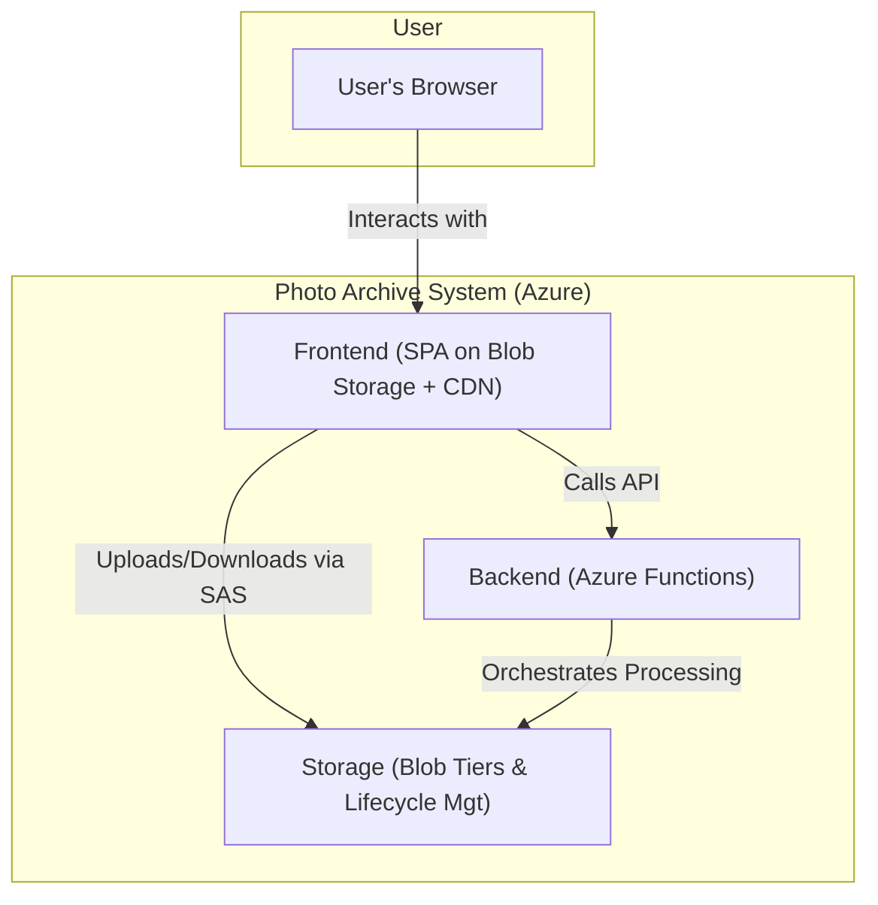
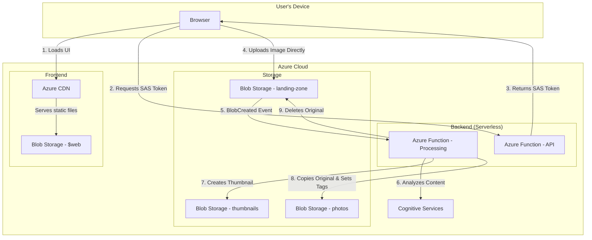
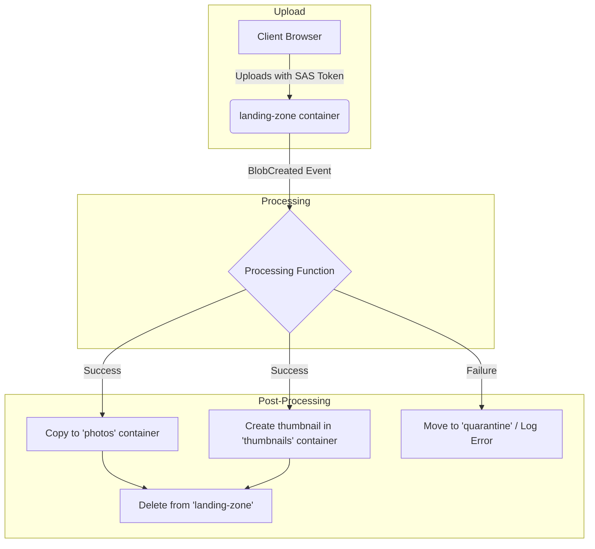

# System Design: Photo Archive

This document outlines the technical design for the Photo Archive application.

## 1. Overall Architecture

The system is designed as a cloud-native, serverless application hosted entirely on Microsoft Azure. It follows a decoupled, event-driven architecture to ensure scalability, resilience, and cost-efficiency.

The architecture is composed of three main parts:

1.  **Frontend:** A static single-page application (SPA) providing the user interface for photo upload and browsing.
2.  **Backend:** A set of serverless Azure Functions responsible for business logic, security, and orchestrating the image processing pipeline.
3.  **Storage:** Azure Blob Storage is used for all data persistence, including original photos, thumbnails, and metadata.

### High-Level System Components

### Detailed Upload & Processing Flow

---

## 2. Component Breakdown

*   **Frontend Web App:**
    *   **Framework:** React (using Create React App or Next.js for static site generation).
    *   **Hosting:** Hosted as a static website on Azure Blob Storage, delivered globally via Azure CDN for low-latency access.
    *   **Functionality:** User authentication, photo upload interface, searchable photo gallery.

*   **Backend API & Processing:**
    *   **Compute:** Azure Functions (Consumption Plan) for a serverless, pay-per-execution model.
    *   **API Endpoints:**
        *   `GenerateUploadSasToken`: A secure HTTP-triggered function that provides a SAS token to the frontend for direct uploads.
        *   `GetPhotos`: An endpoint to retrieve a paginated list of photos and their metadata for the gallery.
    *   **Processing Workflow (Event-Driven):**
        *   `ProcessUploadedImage`: A blob-triggered function that starts the main workflow when a new photo arrives in the landing zone.
        *   `GenerateThumbnails`: An activity function to create smaller versions of the image.
        *   `AnalyzeImageContent`: An activity function that integrates with Azure Cognitive Services to extract tags and metadata.

*   **Data & Storage:**
    *   **Azure Blob Storage:** This is the primary data store for the application, strategically divided into containers with different purposes and performance characteristics.
        *   **`landing-zone` container:** A short-term, temporary container for all new photo uploads. Blobs here are always in the **Hot** tier for immediate processing access.
        *   **`photos` container:** The permanent, long-term archive for the original, full-resolution images after they have been processed. This container is heavily optimized for cost based on access patterns.
        *   **`thumbnails` container:** Stores small, generated thumbnails. As these are accessed frequently for browsing the gallery, they will always remain in the **Hot** tier.
        *   **`$web` container:** Hosts the static frontend application files, also kept in the **Hot** tier for fast UI loading.
    *   **Metadata:** Image metadata (tags, descriptions, camera data, etc.) will be stored directly on the blobs in the `photos` container using Blob Index Tags. This allows for powerful, server-side filtering and searching without needing a separate database.
    *   **Cost Optimization (Lifecycle Management):** The core of the cost-saving strategy revolves around automated tiering in the `photos` container. A lifecycle management policy will be implemented to:
        1.  **Start Hot:** All new photos land in the Hot tier for a period of frequent access (e.g., 30 days).
        2.  **Transition to Cool:** After a period of inactivity (e.g., 30 days without being accessed), blobs are automatically moved to the lower-cost Cool tier.
        3.  **Transition to Archive:** After a longer period of inactivity (e.g., 90 days), blobs are moved to the cheapest Archive tier for long-term preservation. Rehydrating a photo from Archive will be a deliberate, user-initiated action in the UI.

---

## 3. Landing Zone Design

The landing zone is the entry point for all new photos into the system. Its design is critical for decoupling the upload process from the backend processing pipeline, ensuring a fast user experience and a resilient architecture.

### Upload Flow (SAS Token Pattern)

The upload process avoids passing image data through the backend server, instead uploading directly from the client's browser to Azure Storage.

1.  **Initiation (Client):** The user selects a file to upload in the web UI.
2.  **Authorization Request (Client -> Backend):** The frontend makes an authenticated API call to the `GenerateUploadSasToken` function, requesting permission to upload a file with a specific name (e.g., `IMG_1234.jpg`).
3.  **SAS Token Generation (Backend):** The function validates the user's identity and permissions. If successful, it generates a short-lived, limited-permission Shared Access Signature (SAS) token. This token is scoped to allow only a `write` operation for that specific blob name in the `landing-zone` container for a brief period (e.g., 5 minutes).
4.  **Direct Upload (Client -> Azure Storage):** The backend returns the SAS token and the full upload URL to the client. The client then uses this URL to upload the file directly to the `landing-zone` container in Azure Blob Storage.
5.  **Trigger Processing:** Upon successful upload, the "BlobCreated" event is fired by Azure Storage, which automatically triggers the `ProcessUploadedImage` Azure Function, kicking off the backend workflow.

### Processing Workflow

-   **Trigger:** An Azure Function with a Blob Trigger is configured to monitor the `landing-zone` container.
-   **Orchestration:** Upon being triggered, the function will orchestrate the following steps:
    1.  Generate a thumbnail and save it to the `thumbnails` container.
    2.  Call a Cognitive Services endpoint to analyze the image content.
    3.  Copy the original image from `landing-zone` to the final `photos` container.
    4.  Apply the generated tags and other metadata to the new blob in the `photos` container using Blob Index Tags.
    5.  If all previous steps are successful, delete the original file from the `landing-zone` container.
-   **Error Handling:** If any step in the processing fails, the original file is left in the `landing-zone` and an entry is logged to a `quarantine` table or queue for later inspection and retry. This prevents data loss and keeps the main `photos` archive clean.
